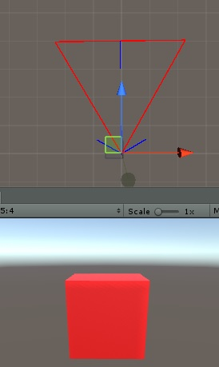

# Unity-Custom-Frustum
Allows you to create your own frustum planes.

### Getting Started

Project made with Unity 2018.2.04b 

The scripts should be able to be taken out and used with any version of unity though.

The example shows a custom frustum. When the cube is in the frustum it turns red. When it leaves the frustum it turns white.

One use is: Object detection. 

Enjoy!
